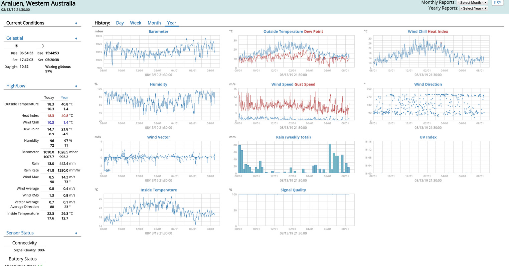

# weewx setup on a RaspberryPi 3 running Arch Linux ARM



Follow the instructions on the [arm arch](https://archlinuxarm.org/) site or use [the picarbs playbook](https://github.com/sthysel/picarbs) to get Arch on the SD card.

## User

Assume the user to run weewx is WEEWX_USER, that user needs rw access to
/dev/ttyUSB on which the Vantage sits, so:

```
$ sudo usermod -aG uucp $WEEWX_USER
```

In ~.bashrc activate venv to ease weewx admin

```
source ~/weewxvenv/bin/activate
export PATH=$PATH:~/weewx/bin/
```
 venv and weewx is installed below


## Install dependencies

```
$ sudo pacman -S freetype2 nginx python2 python2-virtualenv
```

## Setup virtualenv

```
$ virtualenv2 ~/.venvs/weewx
$ source ~/.venvs/weewx/bin/activate
$ pip install configobj Cheetah pillow pyserial pyusb pyephem
```

## Install weewx

Clone weewx into ~/workspace/ and install from there

```
[thys@weather ~]$ tree -d -L 2
.
|-- weewx
|   |-- archive
|   |-- bin
|   |-- docs
|   |-- examples
|   |-- public_html
|   |-- skins
|   `-- util
`-- workspace
    `-- weewx
```

## systemd

Drop in `/etc/systemd/system/weewx.service`

```
[Unit]
Description=weewx weather system
Requires=time-sync.target
After=time-sync.target
RequiresMountsFor=/home

[Service]
ExecStart=/home/WEEWX_USER/weewx/bin/weewxd --daemon --pidfile=/var/run/weewx.pid /home/WEEWX_USER/weewx/weewx.conf
ExecReload=/bin/kill -HUP $MAINPID
Type=simple
PIDFile=/var/run/weewx.pid

[Install]
WantedBy=multi-user.target
```

and enable:

```
$ sudo systemctl enable --now weewx
```


## Install nginx

`/etc/nginx/nginx.conf` pertinent parts. Run nginx as WEEWX_USER

```
user WEEWX_USER;
http {
    server {
        listen       80;
        server_name  localhost;
        location / {
            root /home/WEEWX_USER/weewx/public_html;
            index  index.html index.htm;
        }
    }
}
```
